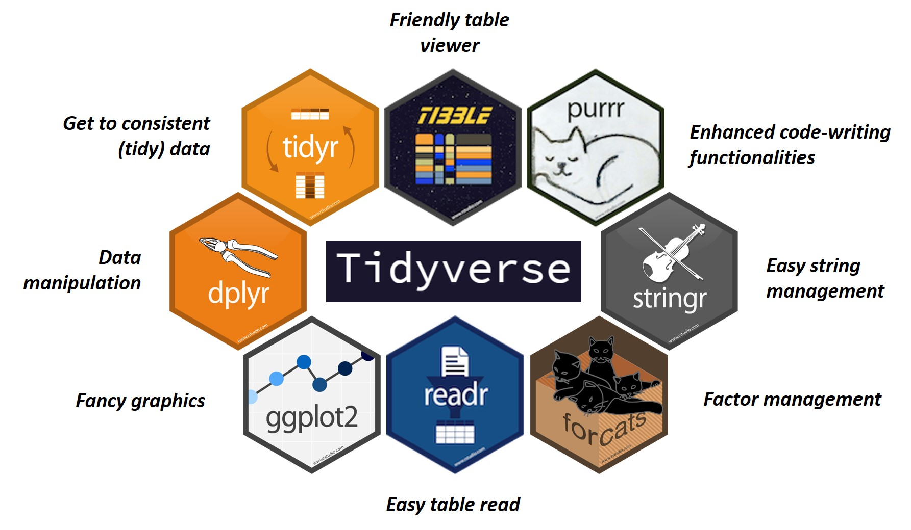

<style>
body {
text-align: justify;
font-size: 12pt}
</style>

```{r setup, include=FALSE}
WD <- "C:/Users/Adrian/Dropbox/Trabajo/1. Doctorado y Cursos/Curso R INIA/"
setwd(WD)
knitr::opts_chunk$set(echo = TRUE, warning = FALSE, message = FALSE)

```

# Introduction:

This is an R Markdown document. Markdown is a simple formatting syntax for authoring HTML, PDF, and MS Word documents. For more details on using R Markdown see http://rmarkdown.rstudio.com.

When you click the Knit button in RStudio, a document will be generated that includes both content as well as the output of any embedded R code chunks within the document. You can embed an R code chunk like this:

```{r codechunk}
summary(cars)

```

You can also embed plots. Adding `echo = FALSE` parameter to the code chunk prevents printing the R code that generated the plot.

```{r plotting, echo=FALSE}
plot(cars)

```

---

# Key Formatting Constructs:
The key formatting constructs are discussed at http://rmarkdown.rstudio.com/authoring_basics.html. Now I'm going to create a series of sections using secondary headings.

## Emphasis
This is *italic*. This is **bold**.

## Super and subscripts:
This is **y^2^**. This is **X~T~**.

## Lists:

### Unordered lists:
This is an unsorted list:

* **ELEMENT A**: Don't forget the ending double space for line break.  
* **ELEMENT B**: We can add unsorted sublists:  
    + Item 1  
    + Item 2  
* **ELEMENT C**: No need of ending double spacing as we leave one empty code line below to finish the list.

We can also add **more text** after the list.

### Ordered ists:

This is a sorted list:

1. **ELEMENT 1**: Don't forget the ending double space for line break.  
    + *Sub-list 1.1*: Also end with double space for line break.  
    + *Sub-list 1.2*: HERE IS JOHNNY.  
    + *Sub-list 1.3*: Another sub-element.  
2. **ELEMENT 2**: POTATO.  
    + *Sub-list 2.1*.  
    + *Sub-list 2.2*: Exactly the same as before.

We can add more text...

## Block quotes:
We can use quotes to cite other people's words, but also as a kind of sub-header.

> This is a block quote. It is so cool! When ending the line with double spacing,  
It can also have multiple lines.

## Displaying Blocks of Code Without Evaluating
In some situations, you want to display R code but not evaluate it. Here is an example of how you format.
```
This text is displayed verbatim / preformatted
```

## Displaying R Code Inline in a Sentence
Sometimes, you need to include an R name or command inline in a sentence. Here is how your format it.

The `sqrt` function computes the square root of a number.

Another example:  
**PERMANOVA model**: `Bray-Curtis distance ~ Breed * Diet`

## Evaluating and Inserting R Code in a Sentence
Sometimes, you want a result without showing the user that you used R to get it. Here is an example.

The mean of the numbers 2,3,4 is `r mean(c(2,3,4))`.

There are lots of ways you can exploit this capability. You can do more advanced calculations in a hidden code block using `include = FALSE`, assign the results to variables, and then simply use the variable names to insert the results in a sentence.

In the following example, I compute the sum of the integers from 2 to 19 in a hidden code block. Then I display the result inline.

```{r computation_1, include=FALSE}
int1 <- 2
int2 <- 19
int_sum <- sum(c(int1:int2))

```

The sum of the integers from `r int1` to `r int2` is `r int_sum`.

## Tables and figures:

> Table example:

| LRA           | **Phylum**    | **Family**    | **Genus**    | **OTU**    |
|---------------|--------------:|--------------:|-------------:|-----------:|
| Total inertia |Some value     |Some value     |Some value    |Some value  |
| N components  |Some value     |Some value     |Some value    |Some value  |

> Example of loading picture:

We must be sure about the path.  
*Note*: For "C:/Users/Adrian/Dropbox" **don't use "C:"**.

```
{#id .class width=60% height=60%}
```

{#id .class width=60% height=60%}

## CSS style basics:
We can modify markdown text font, size, color and alignment with **CSS** commands.
See the [CSS tutorial](https://www.w3schools.com/css/default.asp) for more information.

### General text formatting:
to add a default text format for all our Markdown document, we can add this code below initial RMarkdown parameters:
```
---
title: "RMD TESTING"
author: "Adrian Lopez Garcia"
output:
  html_document:
    code_folding: hide
    collapsed: false
    fontsize: 10
    theme: united
    (...)
  pdf_document: default
  word_document: default
---

<style>
body {
text-align: justify;
font-size: 12pt;
font-family: "Times New Roman", Times, serif}
</style>
```
Note that this will override previous font-format parameters.

### Specific text formatting:
If we only want to format a text chunk, but not all the text in the document, we can use inline styles:
```
<p style="color:blue;margin-left:30px;font-size:10pt;font-weight:bold">This is a normal paragraph</p>
```
<p style="color:blue;margin-left:30px;font-size:10pt;font-weight:bold">This is a normal paragraph</p>

Or open tags for that chunk (*only allows `size`, `color` and `face` arguments*).
```
<font size="2" color="red" face="verdana"> This is my text number2</font>  
<font size="3" color="blue"> This is my text number3</font>  
<font size="4" face="Courier New"> This is my text number4</font>
```
<font size="2" color="red" face="verdana"> This is my text number2</font>  
<font size="3" color="blue"> This is my text number3</font>  
<font size="4" face="Courier New"> This is my text number4</font>

### Styling text spans:
You can apply classes defined in your CSS file to spans of text by using a span tag.

`<span class="emphasized">Pay attention to this!</span>`  
<span class="emphasized">Pay attention to this!</span>

`<span style:"color:red">**This bold text is red colored**</span>`  
<span style="color:red">**This bold text is red colored**</span> 

# Typesetting Equations
## Inline vs. Display Material
Equations can be formatted inline or as displayed formulas. In the latter case, they are centered and set off from the main text. In the former case, the mathematical material occurs smoothly in the line of text.

In order to fit neatly in a line, summation expressions (and similar constructs) are formatted slightly differently in their inline and display versions.

Inline mathematical material is set off by the use of single dollar-sign characters. Consequently, if you wish to use a dollar sign (for example, to indicate currency), you need to preface it with a back-slash. The following examples, followed by their typeset versions, should make this clear.

```
This summation expression $\sum_{i=1}^n X_i$ appears inline.
```
This summation expression $\sum_{i=1}^n X_i$ appears inline.

```
This summation expression is in display form.

$$\sum_{i=1}^n X_i$$
```
This summation expression is in display form.

$$\sum_{i=1}^n X_i$$

## Some LaTeX Basics
In this section, we show you some rudiments of the LaTeX typesetting language.
Follow the [LaTeX cheatsheet](https://wch.github.io/latexsheet/) for more information about symbols in R Markdown.

### Subscripts and Superscripts
A subscript is indicated with the underscore _ character, and a superscript, with a single caret character ^.  
*Note*: this can be confusing, because the R Markdown language delimits superscripts with two carets. In LaTeX equations, a single caret indicates the superscript.

If the subscript or superscript has just one character, there is no need to delimit with braces. However, if there is more than one character, braces must be used.

The following examples illustrate:
```
$$X_i = X_{i}$$
$$X_{i,j} \neq X_i,j$$
```
$$X_i = X_{i}$$
$$X_{i,j} \neq X_i,j$$

Here is an expression that uses both subscripts and superscripts
```
$$X^2_{i,j}$$
```
$$X^2_{i,j}$$

### Square Roots
We indicate a square root using the `\sqrt` operator.  
```
$$\sqrt{b^2 - 4ac}$$
```
$$\sqrt{b^2 - 4ac}$$

### Fractions
Displayed fractions are typeset using the `\frac` operator.
```
$$\frac{4z^3}{16}$$
```
$$\frac{4z^3}{16}$$

### Summation Expressions
These are indicated with the `\sum` operator, followed by a subscript for the material appearing below the summation sign, and a superscript for any material appearing above the summation sign. Here is an example.
```
$$\sum_{i=1}^{n} X^3_i$$
```
$$\sum_{i=1}^{n} X^3_i$$

### Self-Sizing Parentheses
In LaTeX, you can create parentheses, brackets, and braces which size themselves automatically to contain large expressions. You do this using the `\left` and `\right` operators. Here is an example.
```
$$\sum_{i=1}^{n}\left( \frac{X_i}{Y_i} \right)$$
```
$$\sum_{i=1}^{n}\left( \frac{X_i}{Y_i} \right)$$

### Greek Letters
Many statistical expressions use Greek letters. Much of the Greek alphabet is implemented in LaTeX, as indicated in the LaTeX cheat sheet. There are both lower ($\alpha$, $\beta$, $\phi$, $\mu$, $\omega$) and upper case ($\Delta$, $\Phi$, $\Omega$) versions available for some letters (*note that not all letters have an upper case format available*).  

We can also put symbols in display form: $$\phi = \Omega$$

### Special Symbols
All common mathematical symbols are implemented, and you can find a listing on the LaTeX cheat sheet.

Some examples. (Notice that, in the third example, I use the tilde character for a forced space. Generally LaTeX does spacing for you automatically, and unless you use the tilde character, R will ignore your attempts to add spaces.)

```
$$a \pm b$$
$$x \ge 15$$
$$a_i \ge 0~~~\forall i$$
```

$$a \pm b$$ 
$$x \ge 15$$
$$a_i \ge 0~~~\forall i$$

### Special Functions
LaTeX typesets special functions in a different font from mathematical variables. These functions, such as sin, cos, etc. are indicated in LaTeX with a backslash. Here is an example that also illustrates how to typeset an integral.
```
$$\int_0^{2\pi} \sin x~dx$$
```
$$\int_0^{2\pi} \sin x~dx$$

### Matrices
Matrics are presented in the `array` environment. One begins with the statement `\begin{array}` and ends with the statement `\end{array}`. Following the opening statement, a format code is used to indicate the formatting of each column. In the example below, we use the code `{rrr}` to indicate that each column is right justified. Each row is then entered, with cells separated by the `&` symbol, and each line (except the last) terminated by `\\`.
```
$$\begin{array}
{rrr}
1 & 2 & 3 \\
4 & 5 & 6 \\
7 & 8 & 9
\end{array}
$$
```
$$\begin{array}
{rrr}
1 & 2 & 3 \\
4 & 5 & 6 \\
7 & 8 & 9
\end{array}
$$

In math textbooks, matrices are often surrounded by brackets, and are assigned to a boldface letter. Here is an example.
```
$$\mathbf{X} = \left[\begin{array}
{rrr}
1 & 2 & 3 \\
4 & 5 & 6 \\
7 & 8 & 9
\end{array}\right]
$$
```
$$\mathbf{X} = \left[\begin{array}
{rrr}
1 & 2 & 3 \\
4 & 5 & 6 \\
7 & 8 & 9
\end{array}\right]
$$

If you are going to use a lot of matrices, you should place the following early in your document. This creates a new LaTeX command that defines `\mx` to be the equivalent of `\mathbf`.
```
$$\newcommand{\mx}[1]{\mathbf{#1}}$$
```
$$\newcommand{\mx}[1]{\mathbf{#1}}$$

This creates a new LaTeX command that defines \mx to be the equivalent of \mathbf Once you've done this, you can use your new command. For example, `$$\mx{y} = \mx{X\beta}$$` yields:
$$\mx{y} = \mx{X\beta}$$

### Aligning Equations in your Solutions
Suppose you are asked to prove something that requires several lines of development. For example, suppose you are proving that the sum of deviation scores is always equal to zero in any list of numbers. You can align the equations like this. Notice how I define new symbols `\Xbar` and `\sumn` to make things much simpler! Notice the key role that the alignment tab character & plays in telling LaTeX where to align the equations. Also notice the double-backslash newline character at the end of every line of the equation except the last.
```
$$ 
%% Comment -- define some macros
\def\Xbar{\overline{X}_\bullet}
\def\sumn{\sum_{i=1}^{n}}
%%%%%%%%%%%%%%%%%%%%%%%%%%%%%%%
\begin{align}
\sumn \left(X_i - \Xbar\right) &= \sumn X_i - \sumn \Xbar \\
                              &= \sumn X_i - n \Xbar \\
                              &= \sumn X_i - \sumn X_i \\
                              &= 0
\end{align}
$$
```
$$ 
%% Comment -- define some macros
\def\Xbar{\overline{X}_\bullet}
\def\sumn{\sum_{i=1}^{n}}
%%%%%%%%%%%%%%%%%%%%%%%%%%%%%%%
\begin{align}
\sumn \left(X_i - \Xbar\right) &= \sumn X_i - \sumn \Xbar \\
                              &= \sumn X_i - n \Xbar \\
                              &= \sumn X_i - \sumn X_i \\
                              &= 0
\end{align}
$$

### Aligning Equations with Comments
In proving a result, it is often useful to include comments. Here is an example of one way you can do that.
```
$$
\begin{align}
    3+x &=4 && \text{(Solve for} x \text{.)}\\
    x &=4-3 && \text{(Subtract 3 from both sides.)}\\
    x &=1   && \text{(Yielding the solution.)}
\end{align}
$$
```
$$
\begin{align}
    3+x &=4 && \text{(Solve for} x \text{.)}\\
    x &=4-3 && \text{(Subtract 3 from both sides.)}\\
    x &=1   && \text{(Yielding the solution.)}
\end{align}
$$
